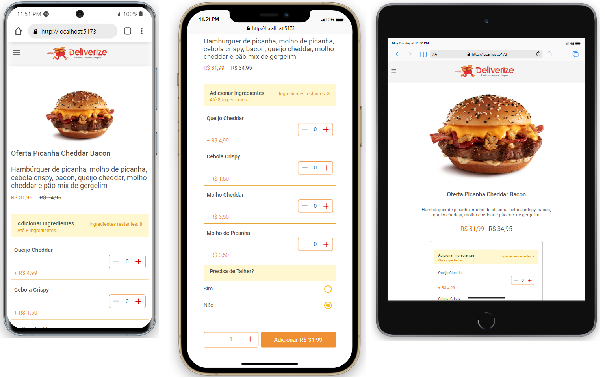
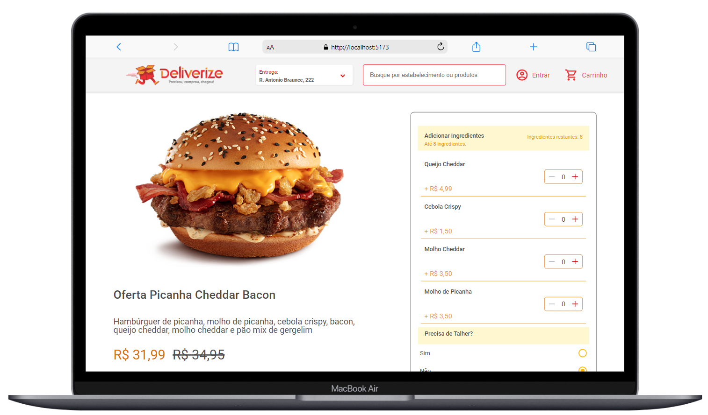

## DELIVERIZE

## ENGLISH
* [DESCRIPTION:](#DESCRIPTION)
* [MADE WITH:](#MADE-WITH)
* [HOW TO RUN:](#HOW-TO-RUN)
* [LIVE DEMO:](#LIVE-DEMO)
<br>

## PORTUGUÊS
* [DESCRIÇÃO:](#DESCRIÇÃO)
* [FEITO COM:](#FEITO-COM)
* [COMO INICIAR O PROJETO:](#COMO-INICIAR-O-PROJETO)
* [PROJETO ONLINE:](#LIVE-DEMO)
<br>

## GIF:


### REPONSIVIDADE / RESPONSIVITY:



# ENGLISH

### DESCRIPTION:
<p>Delivery App with reponsivity.</p>
<br>

### MADE WITH:
<ul>
<li>Typescript</li>
<li>Material-UI</li>
<li>React</li>
<li>uuidv4</li>
<li>Styled Components</li>
</ul>
<br>


## HOW TO RUN:

#### Open your terminal and execute the following commands:
```
git clone https://github.com/andr3felipe/teamsoft-front-end.git
cd teamsoft-front-end
npm i
npm run dev
```

# PORTUGUÊS

### DESCRIÇÃO:
<p>Delivery App com responsividade.</p>
<br>

### FEITO COM:
<ul>
<li>Typescript</li>
<li>Material-UI</li>
<li>React</li>
<li>uuidv4</li>
<li>Styled Components</li>
</ul>
<br>

## COMO INICIAR O PROJETO:

#### Abra o terminal e execute os seguintes comandos:
```
git clone https://github.com/andr3felipe/teamsoft-front-end.git
cd teamsoft-front-end
npm i
npm run dev
```
#### LIVE DEMO:
<a href="https://candid-cheesecake-ae9a80.netlify.app" target="_blank" >Develirize</a>


